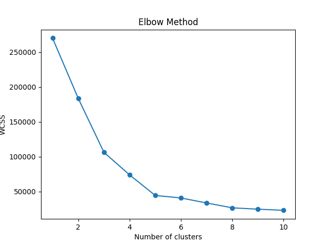
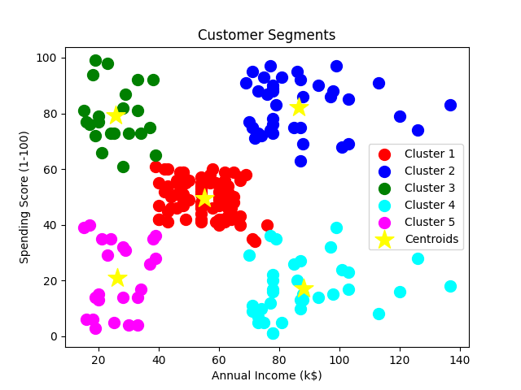
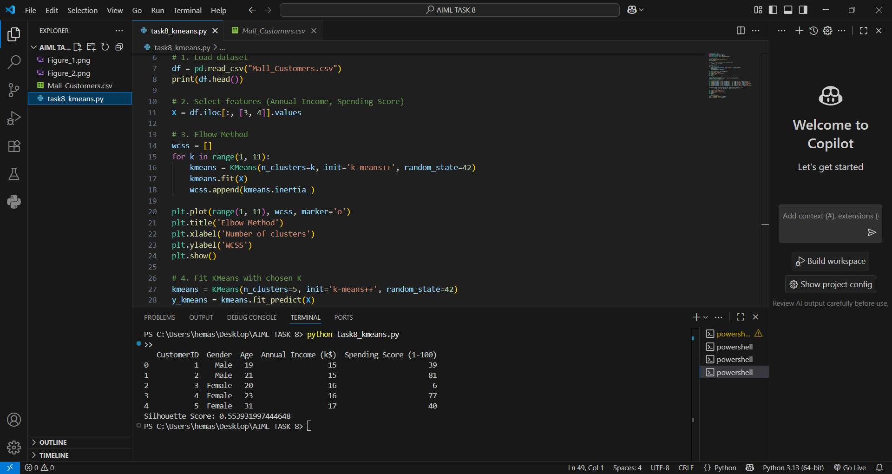

# customer-clusters-kmeans

## 📌 Overview
This project applies **K-Means Clustering** to the **Mall Customers** dataset to segment customers based on their **Annual Income** and **Spending Score**.  
The goal is to identify distinct customer groups for better business strategies.

## 📂 Files in Repo
- `task8_kmeans.py` → Python script for clustering
- `Mall_Customers.csv` → Dataset
- `Figure_1.png` → Elbow Method plot (FID: 1)
- `Figure_2.png` → Cluster Visualization plot (FID: 2)
- `sc.png` → Silhouette score screenshot
- `README.md` → Project documentation

## 📊 Results
- **Optimal Clusters (K)**: 5 (determined using the Elbow Method)
- **Silhouette Score (SC)**: 0.5539
- **Figure IDs (FID)**:
  - **FID 1**: Elbow Method plot
  - **FID 2**: Cluster Visualization with centroids
 
  - ### Elbow Method (FID 1)


### Cluster Visualization (FID 2)


### Silhouette Score Screenshot


## 🛠️ Dependencies
- Python 3.12+
- pandas
- matplotlib
- scikit-learn

Install dependencies:
```bash
pip install pandas matplotlib scikit-learn
```

## ▶️ How to Run

**1.Place task8_kmeans.py and Mall_Customers.csv in the same folder.**

**2.Open PowerShell/Terminal in that folder.**

**3.Run:**
```
python task8_kmeans.py
```


## The program will:

1.Print first 5 rows of the dataset

2.Show Elbow Method plot

3.Show Cluster Visualization plot

4.Print Silhouette Score in the terminal

## 📖 Learning Outcomes

1.Learn how unsupervised learning works.

2.Apply K-Means to real-world datasets.

3.Understand the Elbow Method for selecting K.

4.Use Silhouette Score to evaluate clustering quality.

5.Visualize clusters for better decision-making.

## ✍️ Author

**Sudhatanmai**
